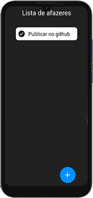
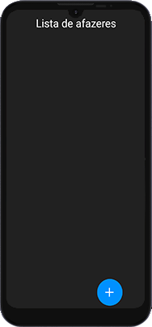
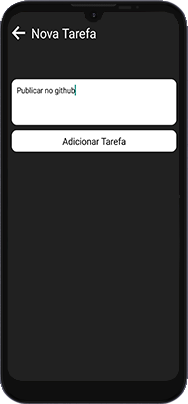

# My task app React Native


## Description 📰

App in react Native, [My task](https://play.google.com/store/apps/details?id=com.lutrizstudios.mylist), to-do list

## 👨‍💻Technology:

* [expo](https://expo.dev/)
* [ReactJS](https://pt-br.reactjs.org/)
* [React Native](https://reactnative.dev/)

### 📖Libs:

* [animatable](https://github.com/oblador/react-native-animatable)
* [AsyncStorage](https://react-native-async-storage.github.io/async-storage/docs/usage/)
* [picker](https://github.com/react-native-picker/picker)
* [AppIntroSlider](https://github.com/Jacse/react-native-app-intro-slider)

### 📚Dependencies version:


## 🎥GIFs:

</img>

## 📷Images:

</img>
</img>
</img>

**Application intro screens. They're even on the app's Slider.**

</img>

**The expo app requires a pre-configured splash screen, in the app I use this one, referring to my [youtube channel](https://www.youtube.com/lutriz)**

## 💻Code:

**As I used some libraries, not necessarily native for expo or React Native, I will leave here part of the code in which I use them.**

### **picker**

``` js
import React, {useState} from 'react';
import {Picker} from '@react-native-picker/picker';

 const [pickerSelect, setPickerSelect] = useState('Simples')
 
  <Picker style={{width:300}}
  selectedValue={pickerSelect}
  onValueChange={(itemValue, itemIndex) => setPickerSelect(itemValue)}>
    <Picker.Item label="Simples" value="Simples" />
     <Picker.Item label="Importante" value="Importante" />
     <Picker.Item label="Muito Importante" value="Muito Importante" />
  </Picker>
```

### **AsyncStorage**

``` js
import React, {useEffect} from 'react';
import AsyncStorage  from  '@react-native-async-storage/async-storage';

  useEffect(() => { 
    async function LoadStorage(){
       const StorageTarefa = await AsyncStorage.getItem('@tarefas')
  
       if(StorageTarefa){
         setTarefa(JSON.parse(StorageTarefa))
       }
    }
  
    LoadStorage()
  }, [])
  
  useEffect(() => {
  async function SaveStorage(){
    await AsyncStorage.setItem('@tarefas', JSON.stringify(tarefa))
  }

  SaveStorage()

  }, [tarefa])


  useEffect(() => { 
    async function LoadApp(){
       const StorageIntro = await AsyncStorage.getItem('@intro')
  
       if(StorageIntro){
         setApp(JSON.parse(StorageIntro))
       }
    }
  
    LoadApp()
  }, [])

  useEffect(() => {
    async function SaveIntro(){
      await AsyncStorage.setItem('@intro', JSON.stringify(app))
    }
  
    SaveIntro()
  
    }, [app])

```

---
**NOTE**

**tarefa** is a state in the code, I recommend that you see the complete code [by clicking here](https://github.com/DutraGames/my-task-app/blob/main/App.js)

---

### **AppIntroSlider**

```js
import AppIntroSlider from 'react-native-app-intro-slider'
import AsyncStorage  from  '@react-native-async-storage/async-storage'

const [app, setApp] = useState(false)

  useEffect(() => { 
    async function LoadApp(){
       const StorageIntro = await AsyncStorage.getItem('@intro')
  
       if(StorageIntro){
         setApp(JSON.parse(StorageIntro))
       }
    }
  
    LoadApp()
  }, [])

  useEffect(() => {
    async function SaveIntro(){
      await AsyncStorage.setItem('@intro', JSON.stringify(app))
    }
  
    SaveIntro()
  
    }, [app])
    
    const slider = [
      {
          key: '1',
          title: 'Introdução',
          desc: 'Aplicativo simples para por as suas tarefas que, você precisa realizar no dia a dia!',
          image: require('./assets/intro1.png')
      },
      {
          key: '2',
          title: 'Como usar?',
          desc: 'Aperte o botão azul com o + para adicionar uma nova tarefa.',
          image: require('./assets/intro2.png')
      },
      {
          key: '3',
          title: 'Bom Uso',
          desc: 'Espero que goste de usar o aplicativo e não deixe de avaliar na play Store.',
          image: require('./assets/intro3.png')
      }
    ]
    
      const AppIntro = ({item})=>{
    return(
      <SafeAreaView style={{flex:1, alignItems:'center', backgroundColor:'#222'}}>
        <View style={{flex:1, alignItems:'center', backgroundColor:'#222'}}>
          <Image  source={item.image} style={{resizeMode: 'cover', marginTop:50}}/>
          <Text style={{fontSize: 30, fontWeight: 'bold', color:'#09acff',padding: 20}}>{item.title}</Text>
          <Text style={{color:'#aaa', fontSize:15, padding:10, textAlign:'center'}}>{item.desc}</Text>
        </View>
      </SafeAreaView>
    )
  }
  
    if(app){
     return(
      <SafeAreaView style={{flex:1, alignItems:'center', backgroundColor:'#222'}}>
        <View style={{flex:1, alignItems:'center', backgroundColor:'#222'}}>
          <Image  source={item.image} style={{resizeMode: 'cover', marginTop:50}}/>
          <Text style={{fontSize: 30, fontWeight: 'bold', color:'#09acff',padding: 20}}>{item.title}</Text>
          <Text style={{color:'#aaa', fontSize:15, padding:10, textAlign:'center'}}>{item.desc}</Text>
        </View>
      </SafeAreaView>
    )
    }
    else{
    ...
    }
```

---
**NOTE**

The code above is just the introduction of the app. .I recommend that you see the complete code [by clicking here](https://github.com/DutraGames/my-task-app/blob/main/App.js)

---

### **animatable**

---
**NOTE**

The animatable is pretty much in all the code I've developed, so I'm just going to put the to-do list code so you can see the example of it in the app.

you can see this full code [by clicking here](https://github.com/DutraGames/my-task-app/blob/main/src/components/Tarefalist/index.jsx)
---

```js
import React, {useState} from 'react'
import {View, Text, StyleSheet, TouchableOpacity} from 'react-native'
import {Ionicons} from '@expo/vector-icons'
import * as Animatatable from 'react-native-animatable'


export default function Tarefalist({data, deletTarefa}){
    return(
        <Animatatable.View style={styles.container}
        animation="bounceIn"
        useNativeDriver
        >
            <TouchableOpacity onPress={() => deletTarefa(data)}>
                <Ionicons name="md-checkmark-circle" size={30} color="#212121"/>
            </TouchableOpacity>
            <View>
                <Text style={styles.tarefa}>{data.tarefa}</Text>
            </View>

            <View>
                <Text style={styles.important}>{data.important}</Text>
            </View>
        </Animatatable.View>
    )
}
```
